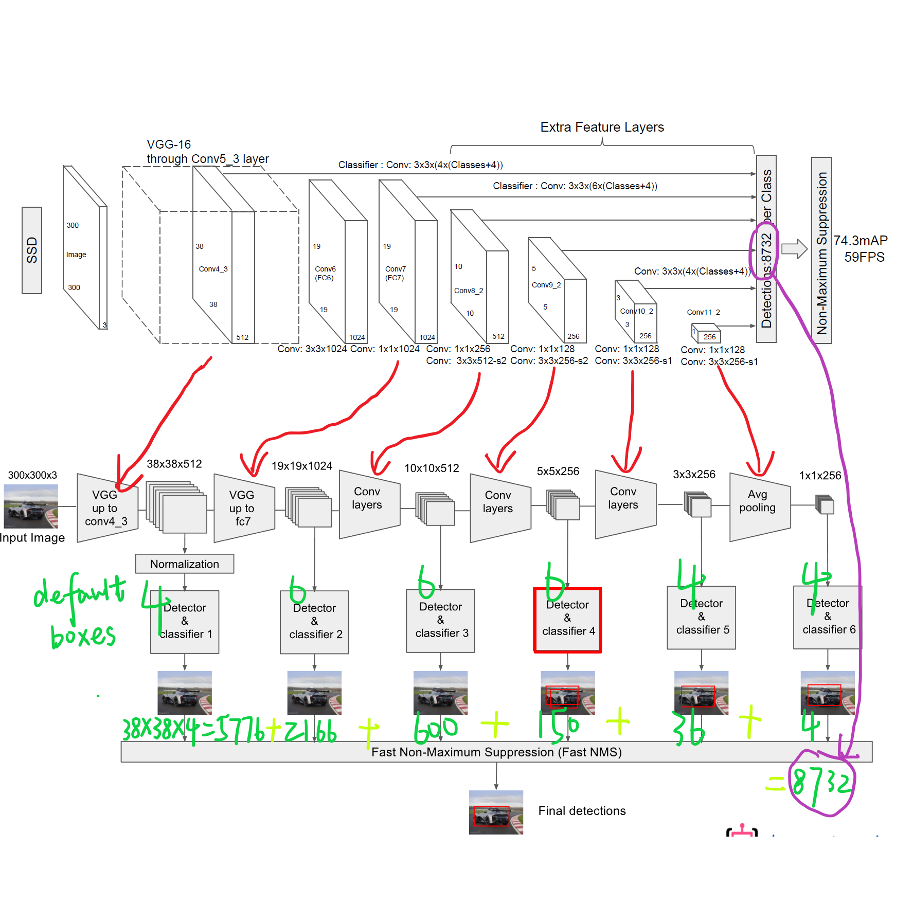

# SSD: Singe Shot MutiBox Detector

作者：WeiLiu, Dragomir Anguelov, Dumitru Erhan, Christian Szegedy 等  
论文链接：https://arxiv.org/abs/1512.02325  
Caffe项目链接：https://github.com/weiliu89/caffe/tree/ssd  
Pytorch项目链接：https://github.com/amdegroot/ssd.pytorch  
TensorFlow项目链接：https://github.com/balancap/SSD-Tensorflow/issues

## 1.前言

## 2.设计理念
### 2.1 采用多尺度特征图用于检测
所谓多尺度采用大小不同的特征图，CNN网络一般前面的特征图比较大，后面会逐渐采用stride=2的卷积或者pool来降低特征图大小，这正如图3所示，一个比较大的特征图和一个比较小的特征图，它们都用来做检测。这样做的好处是比较大的特征图来用来检测相对较小的目标，而小的特征图负责检测大目标，如图4所示，8x8的特征图可以划分更多的单元，但是其每个单元的先验框尺度比较小。
### 2.2 采用卷积进行检测
与Yolo最后采用全连接层不同，SSD直接采用卷积对不同的特征图来进行提取检测结果。对于形状为m×n×p的特征图，只需要采用3×3×p这样比较小的卷积核得到检测值。
### 2.3 设置先验框 prior default box
在Yolo中，每个单元预测多个边界框，但是其都是相对这个单元本身（正方块），但是真实目标的形状是多变的，Yolo需要在训练过程中自适应目标的形状。而SSD借鉴了Faster R-CNN中anchor的理念，每个单元设置尺度或者长宽比不同的先验框，预测的边界框（bounding boxes）是以这些先验框为基准的，在一定程度上减少训练难度。一般情况下，每个单元会设置多个先验框，其尺度和长宽比存在差异，如图5所示，可以看到每个单元使用了4个不同的先验框，图片中猫和狗分别采用最适合它们形状的先验框来进行训练，后面会详细讲解训练过程中的先验框匹配原则。  

  **对于一个大小m×n的特征图，共有mn个单元，每个单元设置的先验框数目记为kk，那么每个单元共需要(c+4)k个预测值，所有的单元共需要(c+4)kmn个预测值，由于SSD采用卷积做检测，所以就需要(c+4)k个卷积核完成这个特征图的检测过程**

