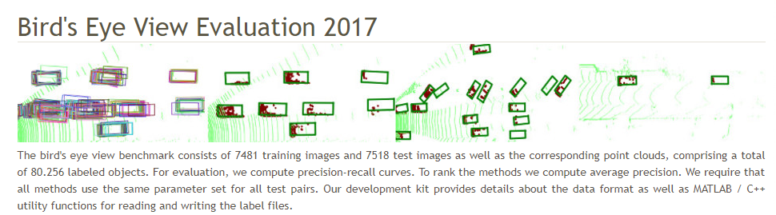
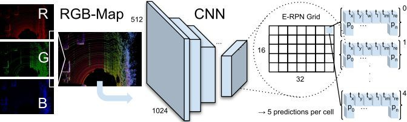
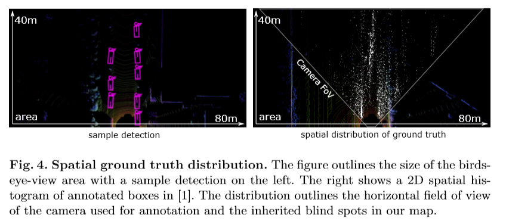
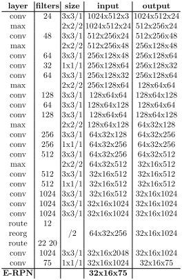
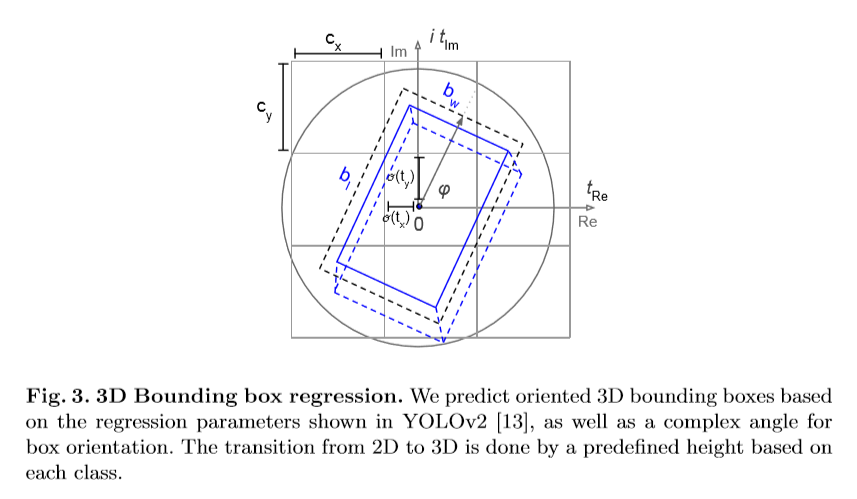
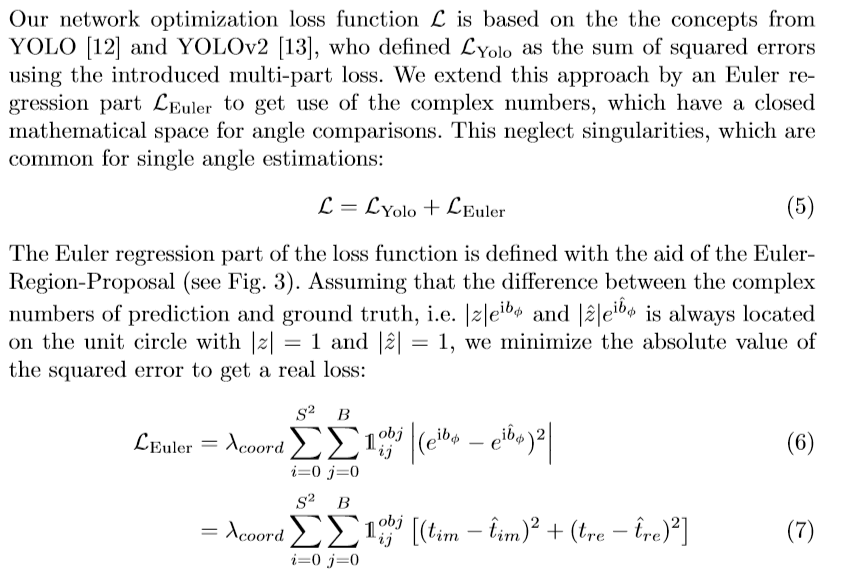
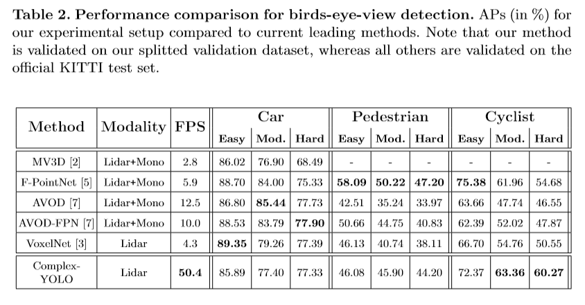
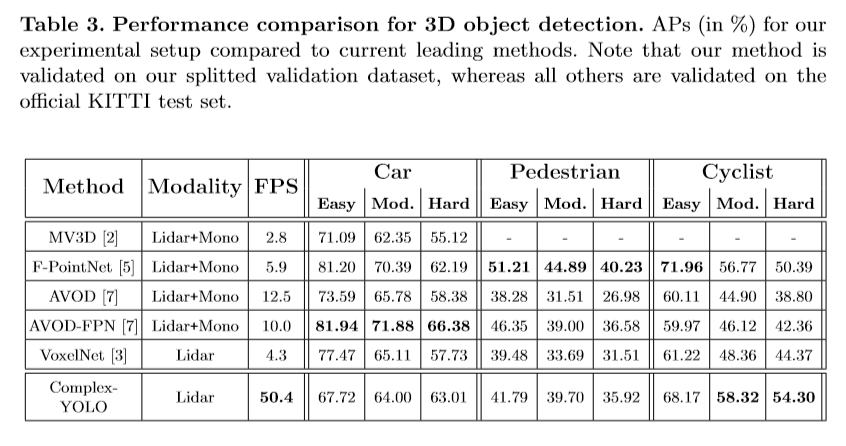

# Complex-YOLO: An Euler-Region-Proposal for Real-time 3D Object Detection on Point Clouds

作者：Martin Simon, Stefan Milz, Karl Amende, Horst-Michael Gross  
论文链接：https://arxiv.org/abs/1803.06199  
项目链接：https://github.com/AI-liu/Complex-YOLO

## 前言

这个文章多次强调一个词，就是 "**Real-Time**"，看他既然叫Yolo那显然最大的优势就在于速度了。  
这里我有个疑问，Kitti上  **Object Detection** 底下有三个类目，**2D Object Detection** ， **3D Object Detection** ， **Bird‘Eye View**,前两个都好理解，最后一个 benchmark 不是很理解，这是一种Evaluation的方式还是什么，跟3D 目标检测的区别在哪呢。

## 介绍

于激光雷达的3D目标检测对于自动驾驶来说不可避免，因为它与环境理解直接相关并且建立了预测和运动规划的基础。本文提出了Complex-YOLO，一个具有最先进性能的、只在点云上进行实时3D目标检测的网络。在这项工作中，作者通过特定的复数回归策略扩展了**YOLOv2**，来在笛卡尔空间中估计多类别3D包围框。为此，作者提出了欧拉区域提议网络 **Euler-Region Proposal Network (E-RPN)** 来估计目标的位姿，添加虚函数和实函数到回归网络中。这样做的结果是能够有封闭的复数空间，避免了在单个角度估计中具有的奇异性。E-RPN泛化性能不错。作者在KITTI数据集上的实验显示，该方法胜过了当前最优秀的3D目标检测算法，尤其是效率。对应车、行人和骑自行车的人的检测结果，该方法达到了当前最优，但是速度提升比最快的算法还要超过五倍。

1、通过E-RPN的可靠角度回归估计3D包围框，提出了Complex-YOLO

2、在KITTI数据集上展示了Complex-YOLO的实时性能以及高准确率

3、使用e-RPN能够为每个3D包围框估计精确的朝向，由此可以估计该对象的轨迹

4、与其他基于激光雷达的方法相比，本文的方法能通过一次前向传递估计所有的类别

## 流程
### 1.点云预处理

这一部我觉得是这个论文工作的最大亮点，就是把点云转换成RGB图像，但是我理解这里的“RGB”并不是真正的RGB，只是转换成一种三通道与图像类似的数据格式而已。

>每一帧由Velodyne HDL64获取的3D点云都转化成一张俯视图的RGB图像，包括80m x 40m的传感器前方范围（见上图）。RGB图像由高度、强度、密度编码。  
最后3D点云投影到2D网格中具有8cm的精度。范围内点的集合为PΩ，  考虑到 z 的范围是因为激光雷达的摆放高度为1.73m，这样大概可以包括进地面以上3m的区域。
利用KITTI数据集给出的标定数据，可以定义将每个点云中的点映射到RGB图像中一个网格的映射函数Sj，描述这个映射的集合为：  
})
P_{Ωi→j} = \{ P_{Ωi} = [x,y,z]^{T}|S_{j} = f_{PS}(P_{Ωi},g)
于是就可以计算每个像素的3个通道，其中zg代表了最大高度，zb为最大强度，zr为该网格内归一化的密度
 = max(P_{\Omega i \to j} \bullet[0,0,1]^{T}))
$$ Z_{b}(S_{j}) = max(I(P_{\Omega i \to j}))$$
$$ Z_{r}(S_{j}) = min(1.0,log(N+1)/64),N = |P_{\Omega i \to j}|$$

从上面公式就可以看出来这里的RGB不过是一种格式而已，但是转化成这种格式以后就使得点云数据可以进行卷积等YOLO的操作

## 2.网络结构

  
网络结构就是简化版的YOLO2的结构，网络的输入就是上一步处理中的"RGB图"，最后一层卷积之后加上了E-RPN

Euler-Region-Proposal，该网络接收CNN提取的特征图像，输出目标的3D位置，大小，类别概率和朝向。各参数定义如下  

 $$b_{x} = \sigma(t_{x})+c_{x}  $$
 $$b_{y} = \sigma(t_{y})+c_{y}  $$
 $$b_{W} = P_{W}e^{t_{w}}  $$
 $$b_{l} = P_{l}e^{t_{l}}  $$
 $$b_{\Phi} = arg(|z|e^{ib_{\phi}})=arctan_{2}(t_{Im},t_{Re})  $$  

- Anchor Box，作者根据尺寸和朝向定义了6种，尺寸分别是车辆、自行车、行人，朝向分别是正前和正后方。
 
- 复角度回归，角度由atan2(im, re)得到。这样一方面可以避免奇异性，另一方面计算会有封闭的数学空间，从而对模型泛化有优势。
 
  
## 3.损失函数

损失函数就是YOLO的Loss加上欧拉部分的损失，直接相加。

  

## 4. 性能

在kitti鸟瞰图上的结果： 

  

在kitti 3D Object Detection的结果： 

 

## 参考链接
感谢分享，侵删
- http://www.sohu.com/a/285118205_715754
- https://blog.csdn.net/cuichuanchen3307/article/details/80164241
