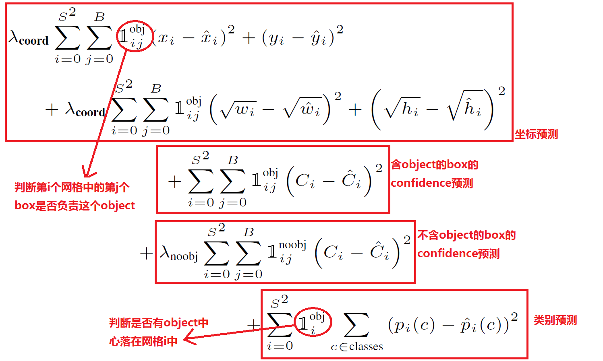

# YouOnlyLookOnce: Unified,Real-TimeObjectDetection
- **Paper Authors** : Joseph Redmon, Santosh Divvala, Ross Girshick, Ali Farhadi 
- **Homepage**: https://pjreddie.com/darknet/yolo/

## 1. 算法
实际上，YOLO并没有真正去掉候选区，而是采用了预定义的候选区（准确点说应该是预测区，因为并不是Faster RCNN所采用的Anchor）。也就是将图片划分为 7*7=49个网格（grid），每个网格允许预测出2个边框（bounding box，包含某个对象的矩形框），总共 49*2=98 个bounding box。可以理解为98个候选区，它们很粗略的覆盖了图片的整个区域。

## 2. YOLO的bounding box并不是Faster RCNN的Anchor

Faster RCNN等一些算法采用每个grid中手工设置n个Anchor（先验框，预先设置好位置的bounding box）的设计，每个Anchor有不同的大小和宽高比。YOLO的bounding box看起来很像一个grid中2个Anchor，但它们不是。YOLO并没有预先设置2个bounding box的大小和形状，也没有对每个bounding box分别输出一个对象的预测。它的意思仅仅是对一个对象预测出2个bounding box，选择预测得相对比较准的那个。  
这里采用2个bounding box，有点不完全算监督算法，而是像进化算法。如果是监督算法，我们需要事先根据样本就能给出一个正确的bounding box作为回归的目标。但YOLO的2个bounding box事先并不知道会在什么位置，只有经过前向计算，网络会输出2个bounding box，这两个bounding box与样本中对象实际的bounding box计算IOU。这时才能确定，IOU值大的那个bounding box，作为负责预测该对象的bounding box。  
训练开始阶段，网络预测的bounding box可能都是乱来的，但总是选择IOU相对好一些的那个，随着训练的进行，每个bounding box会逐渐擅长对某些情况的预测（可能是对象大小、宽高比、不同类型的对象等）。所以，这是一种进化或者非监督学习。

## 3. 一些特点：
### 3.1 输出向量：
YOLO的输出是 7 * 7 * 30, 7 * 7是因为YOLO默认把一张图片分成7*7个Grid 。其中的30是检测结果对应的20种分类的概率，2个Bounding Box 的置信度，两个Bounding box 的位置(x,y,w,h)，用来表示位置的四维数据，所以30=20+1+1+4+4。
### 3.2 一个Object只由它的中心落在的那个grid负责预测

## 4. 网络结构
网络结构借鉴了 GoogLeNet 。24个卷积层，2个全链接层。（用1×1 reduction layers 紧跟 3×3 convolutional layers 取代Goolenet的 inception modules ）

## 5. LOSS
在实现中，最主要的就是怎么设计损失函数，让这个三个方面得到很好的平衡。作者简单粗暴的全部采用了sum-squared error loss来做这件事。 
这种做法存在以下几个问题： 
第一，8维的localization error和20维的classification error同等重要显然是不合理的； 
第二，如果一个网格中没有object（一幅图中这种网格很多），那么就会将这些网格中的box的confidence push到0，相比于较少的有object的网格，这种做法是overpowering的，这会导致网络不稳定甚至发散。 
解决办法：

更重视8维的坐标预测，给这些损失前面赋予更大的loss weight, 记为在pascal VOC训练中取5。  
对没有object的box的confidence loss，赋予小的loss weight，记为在pascal VOC训练中取0.5。  
有object的box的confidence loss和类别的loss的loss weight正常取1。  

对不同大小的box预测中，相比于大box预测偏一点，小box预测偏一点肯定更不能被忍受的。而sum-square error loss中对同样的偏移loss是一样。   
为了缓和这个问题，作者用了一个比较取巧的办法，就是将box的width和height取平方根代替原本的height和width。这个参考下面的图很容易理解，小box的横轴值较小，发生偏移时，反应到y轴上相比大box要大。     

一个网格预测多个box，希望的是每个box predictor专门负责预测某个object。具体做法就是看当前预测的box与ground truth box中哪个IoU大，就负责哪个。这种做法称作box predictor的specialization。

最后整个的损失函数如下所示： 

## 参考链接
侵删
- https://blog.csdn.net/c20081052/article/details/80236015
- https://www.cnblogs.com/fariver/p/7446921.html
